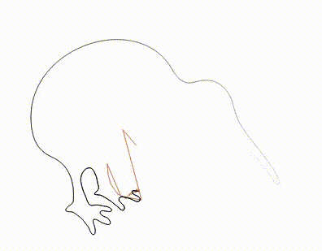

# Fourier SVG Painter

Use Fournier Transform to draw an SVG Path.



## Build

Use cargo to build it:

```
cargo build
```

## Run

At the moment, the program can accept a svg file, and take the first path as the target:

```
cargo run -- -f ./test.svg
```

Or a string with SVG path format:

```
cargo run -- -p "$(cat ./test.svg.txt)"
```

Without panic, there should be an `output.html` file containing the render result. Open it with a browser that supports canvas, and you will see the animation.

## More

- Write "How it works"
- Add more "render backend".
