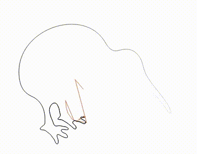

# Fourier SVG Painter

Use Fourier Transform to draw an SVG Path with animated visualizations.



## Project Structure

This is a Cargo workspace containing multiple packages:

- **`fourier-svg`** - Core library with FFT and SVG processing
- **`fourier-cli`** - CLI tool for generating HTML, GIF, and JSON exports
- **`tauri-app`** - Interactive desktop application with drawing capabilities

## Features

- **Multiple Output Formats**:
  - **HTML** - Generate HTML/Canvas animations (default)
  - **GIF** - Export as animated GIF images
  - **JSON** - Export Fourier data for later use

- **Interactive Application** (tauri-app):
  - **SVG File Loading** - Select SVG files and choose specific paths to visualize
  - **Manual Drawing** - Draw shapes directly on canvas with time-stamp capture
  - Adjustable sampling rate (1000-20000 samples)
  - Configurable animation duration (1-60 seconds)
  - Real-time component count adjustment (1-500 components)
  - Coefficient display for each component
  - Speed control and animation controls
  - **Two Input Modes**:
    - SVG File Mode: Load an SVG file, select a path from multiple available paths
    - Drawing Mode: Freehand drawing with time information capture

- **SVG Path Processing** - Accept SVG files or path strings
- **Configurable** - Adjust sample points, wave count, and output settings
- **Cross-platform** - Works on Linux, macOS, and Windows

## Installation

### Standard Build (CLI tools only)

```bash
git clone <repository-url>
cd fourier-svg-rs
cargo build --release --workspace
```

### Interactive Desktop App (Tauri)

**Ubuntu/Debian:**
```bash
sudo apt-get install libwebkit2gtk-4.0-dev libgtk-3-dev libayatana-appindicator3-dev librsvg2-dev
cargo build --release -p tauri-app --features tauri
```

**Fedora:**
```bash
sudo dnf install webkit2gtk3-devel gtk3-devel libappindicator-gtk3-devel librsvg2-devel
cargo build --release -p tauri-app --features tauri
```

**macOS:**
```bash
brew install gtk+3
cargo build --release -p tauri-app --features tauri
```

## Usage

### CLI Tool (fourier-cli)

```bash
# Generate HTML animation
cargo run -p fourier-cli -- -f ./test.svg

# Generate GIF animation
cargo run -p fourier-cli -- -f ./test.svg --backend gif --frames 100

# Export Fourier data to JSON
cargo run -p fourier-cli -- -f ./test.svg --backend export

# Load from exported JSON
cargo run -p fourier-cli -- -i fourier_data.json --backend html
```

### Interactive Desktop App (tauri-app)

The Tauri app now supports two input modes:

**Drawing Mode:**
```bash
cargo run -p tauri-app --features tauri
# - Click and drag on canvas to draw a closed path
# - Time information is captured during drawing
# - Adjust sample rate (1000-20000) and duration (1-60s)
# - Click "Visualize" to see Fourier epicycle animation
```

**SVG File Mode:**
```bash
cargo run -p tauri-app --features tauri
# - Click "Load SVG" button
# - Select an SVG file from file dialog
# - Choose a path from dropdown (if SVG has multiple paths)
# - Adjust sample rate and duration
# - Click "Visualize SVG Path" to see animation
```

**Visualization Controls:**
- Adjust number of Fourier components (1-500)
- Control animation speed (0.1x - 3.0x)
- Pause/play animation
- Reset to beginning
- View coefficient details for each component

**Default Parameters:**
- Sample Rate: 10240 points
- Duration: 10.0 seconds
- Components: 201
- Speed: 1.0x

### Options

```
Options:
  -p, --path <SVG_PATH>      Draw an SVG path in string
  -f, --file <SVG_FILE>      Draw the first SVG path in file
  -i, --input <INPUT>        Load from exported Fourier data JSON file
  -s, --sample <NUM_SAMPLE>  Use how many sample points to draw the path [default: 10240]
  -w, --wave <NUM_WAVE>      Use how many waves to draw the path [default: 201]
  -b, --backend <BACKEND>    Rendering backend: html, gif, export [default: html]
  -o, --output <OUTPUT>      Output file name (without extension) [default: output]
      --frames <FRAMES>      Number of frames for GIF output [default: 100]
  -h, --help                 Print help
  -V, --version              Print version
```

## Docker

### CLI Tools

Build and run CLI tools using Docker:

```bash
# Build the image
docker build -t fourier-svg .

# Run with a file
docker run --rm -v $(pwd)/test.svg:/data/test.svg fourier-svg -f test.svg --backend gif
```

### Tauri Desktop App (Ubuntu 24)

Build the interactive desktop application in a Docker container:

```bash
# Build the Docker image
docker build -t fourier-tauri-app .

# Build the Tauri app
docker run --rm -v $(pwd):/app -w /app fourier-tauri-app \
    cargo build --release --features tauri -p tauri-app

# Run using Docker Compose (for development)
docker-compose up --build
```

**Note:** The Tauri desktop app requires a display server. To run the GUI app from Docker, you'll need to:
1. Use X11 forwarding: `docker run -e DISPLAY=$DISPLAY -v /tmp/.X11-unix:/tmp/.X11-unix ...`
2. Or use VNC/RDP for remote desktop access
3. Or build the app in Docker and copy the binary to run on your host system

## CI/CD

This project uses GitHub Actions for:
- **Continuous Integration** - Automated testing and linting on multiple platforms
- **Code Quality** - Format checking and Clippy linting
- **Release Automation** - Automatic binary builds and releases

Releases are automatically created when tags are pushed (e.g., `v1.0.0`).

## How it works

The program uses Fourier Transform to decompose an SVG path into a series of rotating circles that trace out the original shape. The visualization shows:

1. Multiple circles rotating at different frequencies
2. Each circle's radius and speed determined by FFT coefficients
3. The path traced by the final circle reconstructs the original shape

## License

This project is licensed under the MIT License - see the [LICENSE](LICENSE) file for details.
